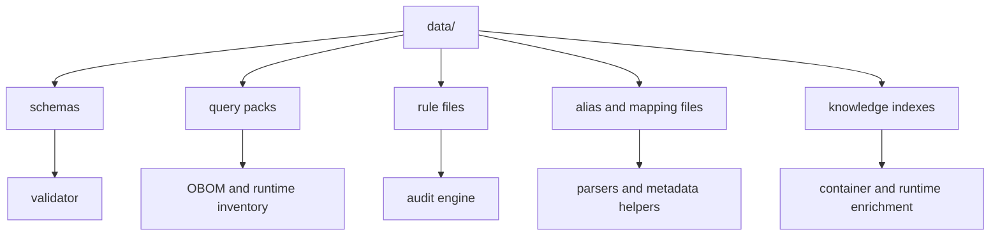
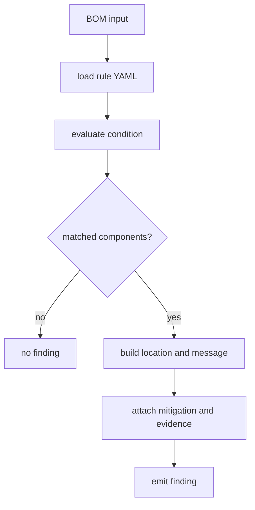

# Introduction

This directory contains static knowledge that cdxgen uses at runtime. Some files are passive reference data. Others directly shape behavior, especially query packs, rule files, schemas, aliases, and component-tag metadata.

## Directory contents

| Filename | Purpose |
|---|---|
| `bom-1.4.schema.json` | CycloneDX 1.4 JSON schema for validation |
| `bom-1.5.schema.json` | CycloneDX 1.5 JSON schema for validation |
| `bom-1.6.schema.json` | CycloneDX 1.6 JSON schema for validation |
| `bom-1.7.schema.json` | CycloneDX 1.7 JSON schema for validation |
| `cbomosdb-queries.json` | osquery queries for identifying SSL packages in OS contexts |
| `component-tags.json` | tags extracted from component descriptions for classification |
| `container-knowledge-index.json` | reference knowledge for container analysis |
| `cosdb-queries.json` | osquery queries useful for identifying OS packages for C |
| `crypto-oid.json` | OID mapping reference used for crypto-aware output |
| `cryptography-defs.json` | cryptography inventory definitions |
| `frameworks-list.json` | string fragments used to classify framework components |
| `gtfobins-index.json` | GTFOBins reference data used for Linux container and runtime executable enrichment |
| `known-licenses.json` | hard-coded license corrections |
| `lic-mapping.json` | fallback license-name to identifier mapping |
| `lolbas-index.json` | LOLBAS reference data used for Windows runtime findings |
| `predictive-audit-allowlist.json` | allowlist data for audit behavior |
| `pypi-pkg-aliases.json` | Python package-name alias data |
| `python-stdlib.json` | Python standard-library entries that can be filtered out |
| `queries.json` | Linux osquery query pack for OBOM and runtime inventory |
| `queries-win.json` | Windows osquery query pack |
| `queries-darwin.json` | macOS osquery query pack |
| `rules/` | built-in BOM audit rule packs in YAML |
| `spdx-licenses.json` | SPDX license identifiers |
| `spdx-export.schema.json` | SPDX 3.0.1 schema used during export validation |
| `spdx.schema.json` | SPDX schema for validation |
| `vendor-alias.json` | vendor or group-name alias fixes |
| `wrapdb-releases.json` | meson wrap database generated from `contrib/wrapdb.py` |

## How this directory fits into the architecture

### ASCII view

```text
runtime code
   |
   +--> lib/cli/* -----------> alias files, framework lists, tag maps
   |
   +--> lib/stages/postgen/* -> rule packs, standards data, schemas
   |
   +--> lib/audit/* ---------> rules/, allowlists, scoring support data
   |
   +--> lib/validator/* -----> CycloneDX and SPDX schemas
   |
   +--> OBOM flows ----------> queries*.json, GTFOBins, LOLBAS, knowledge indexes
```

### Mermaid view



## Query-pack files

The three `queries*.json` files are platform-specific osquery packs. They describe what cdxgen should ask osquery for when generating OS and runtime inventory.

### Query-pack shape

| Field | Required | Purpose |
|---|---|---|
| `query` | yes | SQL executed against osquery |
| `description` | yes | human-readable explanation of the collection intent |
| `purlType` | yes | package URL type used for derived components |
| `componentType` | no | CycloneDX component type when `library` is not appropriate |
| `name` | no | component-name override for result sets that do not naturally expose one |

### Example mental model

```text
queries.json entry
      |
      v
osquery runs SQL
      |
      v
rows come back
      |
      v
cdxgen maps rows into components using purlType and componentType
```

### Good query-pack hygiene

| Practice | Why it matters |
|---|---|
| keep descriptions specific | helps users understand collected categories |
| choose `componentType` carefully | affects how consumers interpret results |
| mirror cross-platform entries intentionally | reduces accidental platform drift |
| keep query scope safe and bounded | avoids expensive or unsafe collection |

## Rule files under `data/rules/`

Rule files are YAML packs consumed by the audit flow. Each file groups rules by a shared theme such as container risk, rootfs hardening, OBOM runtime posture, or AI agent governance.

### Rule evaluation flow

#### ASCII view

```text
input BOM
   |
   v
load YAML rule pack
   |
   v
for each rule
   |
   +--> evaluate JSONata condition against BOM
   +--> collect matching components
   +--> build location object
   +--> render message template
   +--> attach mitigation, evidence, and ATT&CK data
   |
   v
audit findings
```

#### Mermaid view



## Rule schema in practice

Each rule is a YAML list item. These fields matter most.

| Field | Required | Purpose |
|---|---|---|
| `id` | yes | unique stable identifier such as `CTR-001` |
| `name` | yes | short title used in findings |
| `description` | yes | why the rule exists and what it detects |
| `severity` | yes | risk level such as `critical`, `high`, `medium`, `low`, `info` |
| `category` | yes | thematic category that usually aligns with the file grouping |
| `dry-run-support` | yes | whether the rule can work on dry-run style BOMs |
| `condition` | yes | JSONata expression that selects matching components |
| `location` | yes | JSONata expression that builds a location object for the match |
| `message` | yes | rendered finding text, including placeholders |
| `mitigation` | yes | remediation guidance shown with the finding |
| `evidence` | no | extra structured data carried with the finding |
| `attack` | no | MITRE ATT&CK mapping data |

## Writing `condition` expressions

Conditions are written in JSONata and evaluated against the BOM document. In practice, most rules filter the `components` array.

```yaml
condition: |
  components[
    $prop($, 'cdx:some:property') = 'expected-value'
    and type = 'library'
  ]
```

### Helper functions commonly used in rules

| Function | Purpose |
|---|---|
| `$prop(component, name)` | fetches a CycloneDX property by name |
| `$nullSafeProp(component, name)` | null-safe property fetch for comparisons |
| `$listContains(list, value)` | checks list-like property text for a specific entry |
| `$firstNonEmpty(a, b, ...)` | returns the first non-empty value |

### Thinking about rule conditions

A good condition is usually:

1. specific enough to avoid noise
2. readable enough for reviewers to reason about
3. based on stable properties that cdxgen already emits consistently

## Message rendering

The `message` field supports template placeholders using double braces.

```yaml
message: "Package '{{ name }}' at version '{{ version }}' is affected"
```

Those expressions are evaluated in the context of the matched component. Keep messages clear and reviewer-friendly. The message should explain the risk without requiring the reader to decode the raw JSONata condition.

## Adding a new rule safely

Use this sequence.

1. choose the correct category file under `data/rules/`
2. draft the condition against a real BOM sample
3. keep the location object small and actionable
4. add mitigation text that tells the user what to do next
5. add or update tests in `lib/stages/postgen/auditBom.poku.js`

## Choosing between a rule, a query-pack entry, and a helper-data file

| If you need to add... | It probably belongs in... |
|---|---|
| a new risk detection idea over existing BOM fields | `data/rules/*.yaml` |
| a new host or runtime collection source | `queries*.json` |
| a new alias, mapping, or classifier list | another JSON file in `data/` |
| a new schema or validation artifact | `data/*schema*.json` |

## Maintenance advice

This directory changes slowly, but small mistakes here can affect a lot of runtime behavior. Treat edits as code, not content.

| Habit | Why it helps |
|---|---|
| keep examples close to real emitted fields | avoids stale rules |
| review platform symmetry for query packs | avoids one-OS regressions |
| test new rules with realistic BOM fixtures | catches false positives early |
| document new files here | keeps contributors oriented |
