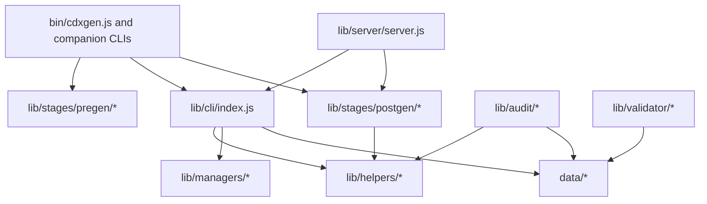
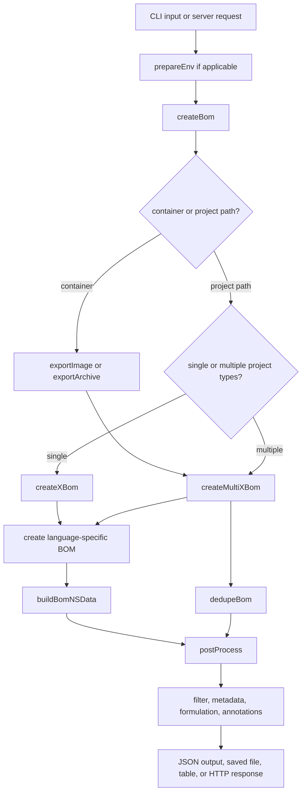

# Architecture Overview

This page gives contributors a practical map of the cdxgen codebase. The goal is simple. If you know what kind of change you want to make, you should be able to identify the right folder, the right entry point, and the right boundary before you open an editor.

## Why this page exists

cdxgen is broad by design. It supports many ecosystems, several command variants, container and host inventory, and a final post-generation shaping pass. That flexibility is useful, but it also means new contributors often need one page that explains how the pieces relate.

A good mental model is:

1. `bin/` gathers user intent and creates the `options` object.
2. `lib/cli/index.js` decides what kind of target it is scanning and assembles raw BOM data.
3. `lib/stages/postgen/` runs the once-per-BOM cleanup and enrichment pass.

Everything else supports one of those jobs.

## Repository map

| Path | Main role | Reach for it when you need to... |
|---|---|---|
| `/home/runner/work/cdxgen/cdxgen/bin/` | CLI entry points | add or change a command-line flag, startup flow, or output writing |
| `/home/runner/work/cdxgen/cdxgen/lib/cli/index.js` | Core BOM generation | add an ecosystem, change detection, or alter component assembly |
| `/home/runner/work/cdxgen/cdxgen/lib/helpers/` | Shared helpers and parsers | add a parser, metadata helper, or cross-cutting utility |
| `/home/runner/work/cdxgen/cdxgen/lib/stages/pregen/` | Environment preparation | change SDK installation or preflight behavior |
| `/home/runner/work/cdxgen/cdxgen/lib/stages/postgen/` | Final BOM shaping | change filtering, metadata, formulation, standards, or annotations |
| `/home/runner/work/cdxgen/cdxgen/lib/managers/` | Container and package-manager helpers | change Docker, OCI, binary, or pip-tree integration |
| `/home/runner/work/cdxgen/cdxgen/lib/audit/` | Predictive audit engine | change rule execution, risk scoring, or reporters |
| `/home/runner/work/cdxgen/cdxgen/lib/server/` | HTTP server | change request handling or server-side generation |
| `/home/runner/work/cdxgen/cdxgen/lib/validator/` | Validation | change CycloneDX or SPDX validation behavior |
| `/home/runner/work/cdxgen/cdxgen/data/` | Static runtime data | add schemas, query packs, aliases, rules, or knowledge indexes |
| `/home/runner/work/cdxgen/cdxgen/test/` | Fixtures | add representative manifests, lock files, or expected results |
| `/home/runner/work/cdxgen/cdxgen/docs/` | Documentation | explain features, contributor flows, or troubleshooting |
| `/home/runner/work/cdxgen/cdxgen/types/` | Generated types | do not edit manually |

## Architecture in one screen

### ASCII layering diagram

```text
                        +----------------------+
                        |    bin/cdxgen.js     |
                        |   lib/server/*       |
                        +----------+-----------+
                                   |
                                   v
                        +----------------------+
                        |  lib/cli/index.js    |
                        | createBom()          |
                        | createXBom()         |
                        | createMultiXBom()    |
                        +----------+-----------+
                                   |
                  +----------------+----------------+
                  |                                 |
                  v                                 v
        +----------------------+         +----------------------+
        |   lib/helpers/*      |         | lib/stages/postgen/* |
        | parsers, utils,      |         | filter, metadata,    |
        | metadata helpers     |         | formulation, annotate|
        +----------------------+         +----------------------+
                  |
                  v
        +----------------------+
        |  lib/managers/*      |
        | Docker, OCI, pip     |
        +----------------------+
```

### Mermaid layering diagram



## Runtime flow from command line to BOM

### ASCII runtime flow

```text
User command
   |
   v
bin/cdxgen.js
   |
   +--> prepareEnv()           optional SDK and tool preparation
   |
   +--> createBom()
           |
           +--> container export setup?       exportImage()/exportArchive()
           |
           +--> single-type path?             createXBom()
           |        |
           |        +--> create<Language>Bom()
           |                 |
           |                 +--> buildBomNSData()
           |
           +--> multi-type path?              createMultiXBom()
                    |
                    +--> create<Language>Bom() for each relevant type or path
                    +--> dedupeBom()
   |
   v
postProcess()
   |
   +--> filterBom()
   +--> applyStandards()
   +--> applyMetadata()
   +--> applyFormulation()
   +--> annotate()
   |
   v
write bom.json / print summary / return server response
```

### Mermaid runtime flow



## Module responsibilities in plain language

### `bin/`

The `bin/` directory is where user intent becomes an `options` object. The CLI decides what the input path is, whether purl source resolution is needed, whether server mode or a companion command is in use, and when final output should be written.

If you are changing a command-line flag, help text, default option, or command startup behavior, begin here.

### `lib/cli/index.js`

This file is the heart of cdxgen. It contains the large dispatcher that detects project types, the per-language `create<Language>Bom` functions, and the code that merges multi-type results.

This is usually the right place when you want to:

1. add support for a new ecosystem
2. change detection rules for an existing ecosystem
3. adjust how raw package lists become BOM components and dependencies

### `lib/helpers/`

This is the shared library layer. It contains lockfile parsers, metadata fetch helpers, path and environment utilities, logger helpers, purl helpers, release-note helpers, and other reusable logic.

If a function would otherwise be imported by both `lib/cli/` and `lib/stages/`, it should usually live here.

### `lib/stages/pregen/`

The pre-generation stage prepares the environment before BOM generation starts. Today that mostly means setting up or installing missing SDKs and package-manager prerequisites.

The key nuance is that pre-generation is about the execution environment, not the BOM document itself.

### `lib/stages/postgen/`

The post-generation stage is where cdxgen makes one final pass over the assembled BOM. This is where filtering, standards application, metadata normalization, formulation, release notes, and annotations happen.

This stage runs once per BOM cycle, which makes it the correct place for logic that should not repeat for every language type in a multi-type scan.

### `lib/managers/`

Managers connect cdxgen to more specialised domains such as Docker, OCI image extraction, binary inspection, and pip dependency trees. They are support layers for the main generator, not the final assembly point.

### `lib/audit/`

The audit engine evaluates generated BOMs against rule packs and scoring models. It is adjacent to BOM generation, not part of the core assembly path.

### `data/`

This folder is part of the architecture, not just storage. Query packs, rule YAML, license lists, alias maps, and schemas all influence runtime behavior.

## The most important boundary to remember

The strongest architectural rule in cdxgen is the layering rule.

| Layer | May import from | Must not import from |
|---|---|---|
| `lib/helpers/*` | npm packages, `node:*`, local helper modules | `lib/cli/*`, `lib/stages/*`, `bin/*` |
| `lib/cli/*` | helpers, managers, parsers, data | `bin/*` |
| `lib/stages/postgen/*` | helpers, data | `lib/cli/index.js` |
| `bin/*` and `lib/server/*` | cli, stages, helpers | lower layers importing back upward |

If you are about to import `../../cli/index.js` inside a helper or stage file, stop and move the shared logic into `/home/runner/work/cdxgen/cdxgen/lib/helpers/` first.

## Where common changes belong

| Change you want | First place to inspect |
|---|---|
| Add a new `--flag` | `/home/runner/work/cdxgen/cdxgen/bin/cdxgen.js` |
| Add a new ecosystem | `/home/runner/work/cdxgen/cdxgen/lib/cli/index.js` and `/home/runner/work/cdxgen/cdxgen/lib/helpers/utils.js` |
| Add a new query-pack table | `/home/runner/work/cdxgen/cdxgen/data/queries*.json` |
| Add a new audit rule | `/home/runner/work/cdxgen/cdxgen/data/rules/*.yaml` and `/home/runner/work/cdxgen/cdxgen/lib/stages/postgen/auditBom.poku.js` |
| Change filtering behavior | `/home/runner/work/cdxgen/cdxgen/lib/stages/postgen/postgen.js` |
| Change release-note logic | `/home/runner/work/cdxgen/cdxgen/lib/stages/postgen/postgen.js` and the helpers it calls |
| Change container export behavior | `/home/runner/work/cdxgen/cdxgen/lib/managers/docker.js` or `/home/runner/work/cdxgen/cdxgen/lib/managers/oci.js` |
| Change validation behavior | `/home/runner/work/cdxgen/cdxgen/lib/validator/` |

## The `options` object as the shared contract

One reason cdxgen stays workable despite its size is that nearly every public entry point accepts the same `options` object. That object originates in the CLI, flows into `createBom()`, continues into per-language generators, and is finally used again in post-processing.

That means a new feature is usually easiest to add when you thread it through `options` once and then read it where needed, rather than trying to infer CLI intent deep inside library code.

## Companion binaries and plugins

Some features depend on optional companion tools shipped through `cdxgen-plugins-bin`. These helpers extend the architecture without changing its core shape.

| Helper | Used for |
|---|---|
| Trivy | container and rootfs inventory |
| osquery | OBOM host and runtime collection |
| SourceKitten | Swift and Apple ecosystem extraction |
| dosai and related binaries | binary and OS inventory enrichment |

When those binaries are unavailable, cdxgen often falls back to lighter built-in behavior. That fallback path is part of the design, so documentation and tests should treat plugin availability as variable rather than guaranteed.

## Reading order for new contributors

If you are new to the repository, this order works well:

1. read `/home/runner/work/cdxgen/cdxgen/bin/cdxgen.js` around option handling and the `createBom` call
2. read `/home/runner/work/cdxgen/cdxgen/lib/cli/index.js` around `createBom`, `createMultiXBom`, and one ecosystem you already understand
3. read `/home/runner/work/cdxgen/cdxgen/lib/stages/postgen/postgen.js` to understand the once-per-BOM cleanup and enrichment step

## Related pages

- [BOM Generation Pipeline](BOM_PIPELINE.md)
- [Adding Support for a New Language or Ecosystem](ADD_ECOSYSTEM.md)
- [Testing Guide](TESTING.md)
