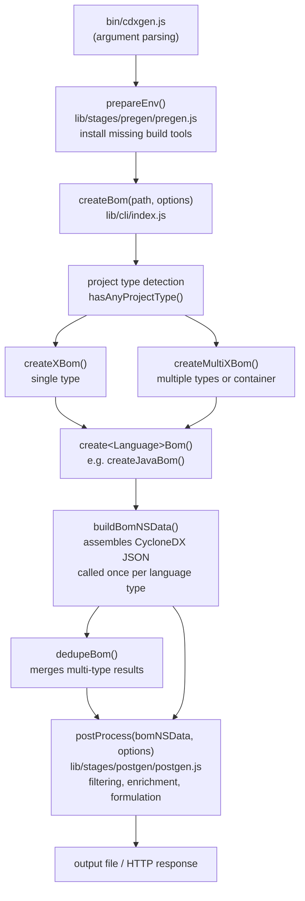

# Architecture Overview

This page describes how cdxgen is structured internally so you can navigate the codebase confidently and know where to make a change.

## High-level module layout

```
bin/                  CLI entry points
lib/
  cli/index.js        Core BOM generation (create*Bom functions)
  helpers/            Shared utilities, parsers, and data helpers
  stages/
    pregen/           Environment preparation before generation
    postgen/          Post-processing and filtering after generation
  managers/           Docker, OCI, and pip tree helpers
  parsers/            Small focused parsers (IRI, npmrc)
  audit/              Predictive supply-chain audit engine
  evinser/            Evinse / SaaSBOM evidence generation
  server/             HTTP server entry point
  validator/          CycloneDX JSON schema validation
data/                 Static data files (schemas, query packs, rule YAML)
test/                 Fixture files used by poku tests
types/                Auto-generated TypeScript declarations (do not edit)
docs/                 This documentation
contrib/              Community scripts (not linted by CI)
```

## Module layering

The source layers form a strict one-directional dependency graph. Nothing in a lower layer may import from a higher one.

```
lib/helpers/*
      |
      v
lib/cli/index.js
      |
      v
lib/stages/postgen/    (also imports helpers, never imports cli/)
      |
      v
bin/cdxgen.js  /  lib/server/server.js
```

If you need logic that both `lib/cli/` and `lib/stages/` share, extract it into a helper module under `lib/helpers/` first.

## Data flow diagram

The diagram below shows how a single `cdxgen` invocation flows through the codebase from command line to output file.



## Key source files

| File | What it does |
|---|---|
| `bin/cdxgen.js` | Parses CLI arguments, calls `createBom`, writes output |
| `lib/cli/index.js` | ~10 000 lines; one `create*Bom` function per language |
| `lib/helpers/utils.js` | ~18 000 lines; most manifest parsers and shared utilities |
| `lib/helpers/logger.js` | `thoughtLog` and `traceLog` for debug and trace output |
| `lib/helpers/depsUtils.js` | `mergeDependencies` and `trimComponents` |
| `lib/helpers/formulationParsers.js` | `addFormulationSection` for the formulation BOM section |
| `lib/stages/pregen/pregen.js` | Installs missing SDKs before generation |
| `lib/stages/postgen/postgen.js` | Post-processing; runs exactly once per BOM cycle |
| `lib/server/server.js` | connect-based HTTP server |
| `lib/managers/binary.js` | Container and rootfs inventory |
| `lib/managers/oci.js` | OCI image layer extraction |
| `data/rules/` | Built-in BOM audit rule packs (YAML with JSONata conditions) |
| `data/queries*.json` | osquery query packs for Linux, Windows, and macOS OBOM |

## The `options` object

Every public function in the library accepts a single plain `options` object that originates in `bin/cdxgen.js` and flows unchanged through the entire call chain. Do not read `process.argv` inside library code. Add new flags to the yargs builder in `bin/cdxgen.js` and access them through `options`.

## Companion plugin binaries

cdxgen can use the optional `cdxgen-plugins-bin` package for heavy native helpers including Trivy (container scanning), osquery (OBOM), SourceKitten (Swift), and dosai (binary analysis). When the package is absent, cdxgen falls back to built-in parsers. The companion binary path is resolved via `CDXGEN_PLUGINS_DIR`.

## Further reading

- [BOM Generation Pipeline](BOM_PIPELINE.md) for a step-by-step walkthrough of what happens at runtime
- [Adding a New Ecosystem](ADD_ECOSYSTEM.md) for a guide on extending cdxgen with support for a new language
- [Testing Guide](TESTING.md) for how to write and run poku tests
