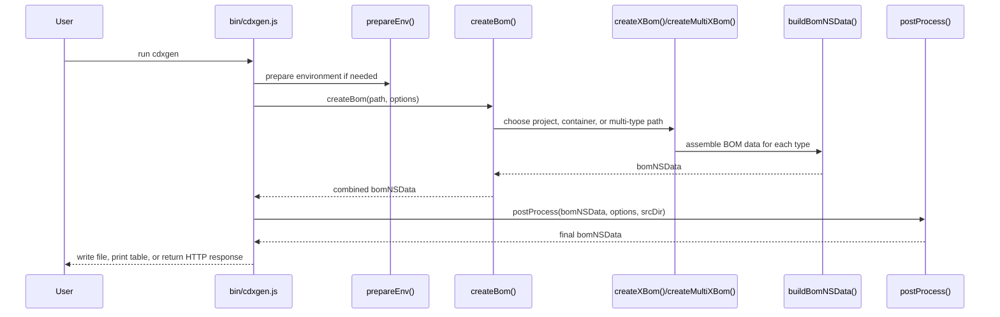
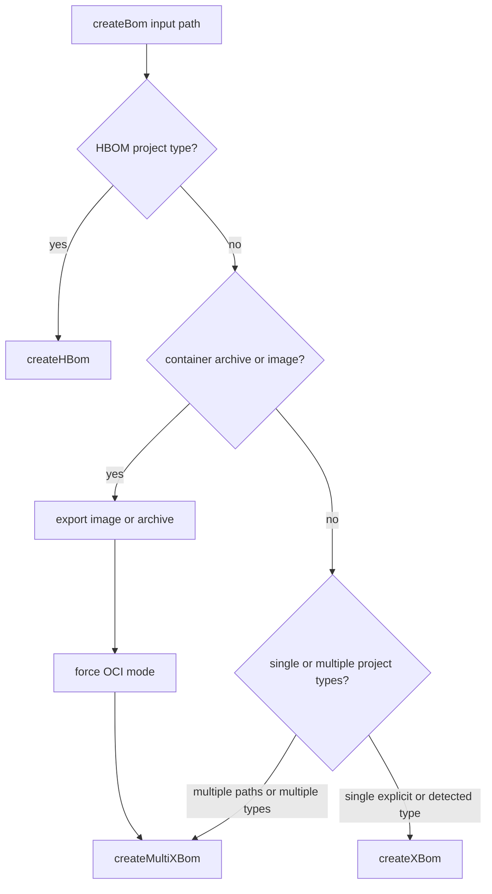

# BOM Generation Pipeline

This page explains what happens during a cdxgen run from input discovery to final JSON. It is written for users who want to understand timing and error sources, and for contributors who need a correct mental model before changing the generator.

## The short version

A cdxgen run is easiest to understand as five steps:

1. normalise the input and prepare the environment
2. decide whether the target is a project, a container image, or a live host view
3. discover supported manifests and lock files
4. assemble one or more language-specific BOM fragments
5. run one final post-processing pass and emit output

## Pipeline at a glance

### ASCII pipeline

```text
user input
   |
   +--> local directory
   |      |
   |      +--> prepareEnv()
   |      +--> createBom()
   |              |
   |              +--> createXBom() or createMultiXBom()
   |              +--> create<Language>Bom()
   |              +--> buildBomNSData()
   |
   +--> container reference or archive
   |      |
   |      +--> exportImage()/exportArchive()
   |      +--> createMultiXBom()
   |
   +--> purl source input
          |
          +--> resolve source repository
          +--> treat as local source path

all paths converge into:

postProcess()
   |
   +--> filterBom()
   +--> applyStandards()
   +--> applyMetadata()
   +--> applyFormulation()
   +--> annotate()
   |
   v
final CycloneDX JSON and optional side effects
```

### Mermaid sequence diagram



## Step 1: Input normalisation and environment preparation

The CLI accepts more than one style of input. A run may start from:

| Input style | What cdxgen does first |
|---|---|
| local source directory | prepares SDKs and scans for manifests |
| container image reference | exports the image before dependency extraction |
| container archive (`.tar`, `.tar.gz`) | explodes the archive into layers and treats it as OCI input |
| purl source reference | resolves it to a source repository first |

For standard CLI usage, `/home/runner/work/cdxgen/cdxgen/bin/cdxgen.js` calls `prepareEnv(srcDir, options)` before `createBom()`. `prepareEnv()` is synchronous and may install or configure required tools for Python, Node.js, Swift, Ruby, or SDKMAN-managed Java versions.

That means the first class of failures usually happens before BOM generation itself has started.

## Step 2: Mode selection inside `createBom()`

`createBom()` is the top-level dispatcher in `/home/runner/work/cdxgen/cdxgen/lib/cli/index.js`.

Its first job is not language detection. Its first job is deciding what kind of thing the path represents.

### Mode decision diagram



This matters because container mode short-circuits a lot of the usual source-project assumptions. In container mode, `createBom()` forces OCI-style handling, disables dependency installation, establishes parent container metadata, and passes exploded layer paths into the multi-type flow.

## Step 3: Project-type detection and manifest discovery

For project directories, cdxgen detects ecosystems by looking for known manifests and lock files. `createXBom()` contains the single-project detection flow. It checks the current path for signals such as:

| Ecosystem family | Typical detection files |
|---|---|
| Node.js | `package.json`, `rush.json`, `yarn.lock` |
| Java and JVM | `pom.xml`, `build.gradle*`, `build.sbt` |
| Python | `pyproject.toml`, `poetry.lock`, `Pipfile`, `requirements*.txt`, `*.whl` |
| Go | `go.mod`, `go.sum`, `Gopkg.lock` |
| Rust | `Cargo.toml`, `Cargo.lock` |
| PHP | `composer.json`, `composer.lock` |

Filtering options affect discovery before generation starts:

| Option | Effect |
|---|---|
| `-t` / `--type` | narrows generation to selected project types |
| `--exclude-type` | prevents matching types from running |
| `--include-regex` | narrows manifest search to matching paths |
| `--exclude` | removes paths from discovery |
| recursion controls | change how broadly the tree is searched |

## Step 4: Per-language BOM assembly

Once a project type has been selected, cdxgen calls a specific generator such as `createJavaBom()`, `createGoBom()`, or `createRubyBom()`.

Each of those functions follows the same broad pattern:

1. locate relevant manifests and lock files
2. parse them into a package list
3. optionally invoke the ecosystem toolchain to get a deeper tree
4. optionally fetch metadata from registries
5. hand the package list to `buildBomNSData()`

### Per-language flow

```text
create<Language>Bom(path, options)
   |
   +--> find files for that ecosystem
   +--> parse lockfile or manifest
   +--> optionally run package-manager command
   +--> optionally enrich with registry metadata
   +--> buildBomNSData(options, pkgList, projectType, context)
```

The most important contributor detail here is that `buildBomNSData()` is called once per language type, not once per final BOM. If a scan includes Java, Node.js, and Python, it will be called three times.

## Step 5: Multi-type merge and deduplication

When `createMultiXBom()` is used, cdxgen walks the provided paths and relevant project types, collects components and dependency edges into shared arrays, and then calls `dedupeBom()` at the end.

This loop is iterative in the current implementation. The function appends results as it goes, then performs one combined deduplication pass.

### ASCII merge view

```text
path A + js scan  ----+
path A + java scan --+ |
path B + py scan ----|-+--> combined components[]
path B + os scan ----+ |    combined dependencies[]
                      |
                      +--> dedupeBom()
                              |
                              v
                       merged bomNSData
```

## Step 6: Post-processing

After `createBom()` returns, the CLI calls `postProcess(bomNSData, options, srcDir)`.

This is where cdxgen performs its once-per-BOM work in a fixed order:

| Order | Function | Purpose |
|---|---|---|
| 1 | `filterBom()` | applies include, exclude, confidence, required-only, and related filters |
| 2 | `applyStandards()` | adds standard-related metadata and compatibility shaping |
| 3 | `applyMetadata()` | normalises source-file and purl-derived metadata |
| 4 | `applyContainerInventoryMetadata()` | adds container inventory metadata where relevant |
| 5 | `applyFormulation()` | adds formulation data such as build tools and git context |
| 6 | `applyReleaseNotes()` | computes release notes when enabled |
| 7 | `applySpecVersionCompatibility()` | adjusts output for the chosen spec version |
| 8 | `validateTlpClassification()` | enforces TLP-related metadata rules |
| 9 | `annotate()` | adds annotations when the spec version supports them |

### Why this matters

If you are trying to understand why a component was removed, why formulation only appears once, or why metadata paths look relative instead of absolute, this is the phase to inspect.

## Where different classes of errors originate

| What you see | Most likely phase | What it usually means |
|---|---|---|
| missing SDK or package manager | environment preparation | the machine or image lacks a required tool |
| no manifests found | discovery | the directory is wrong, filtering is too broad, or the type was misdetected |
| shallow dependency tree | per-language assembly | the package-manager command failed or only a lockfile was available |
| duplicate or missing components after merge | multi-type merge | overlapping scans produced duplicates and dedupe logic collapsed them |
| components unexpectedly absent in final JSON | post-processing | filters or spec-compatibility changes removed or transformed them |

## What changes runtime cost the most

| Cost driver | Why it is expensive |
|---|---|
| dependency installation | package-manager network calls and build steps |
| deep and evidence modes | extra analysis and slice generation |
| registry metadata enrichment | outbound HTTP calls for many components |
| container export | image pull, layer export, and plugin execution |
| very large monorepos | repeated manifest discovery and many per-type scans |

## Practical debugging order

When a run looks wrong, use this order.

1. confirm the input path or image reference is what you think it is
2. re-run with `CDXGEN_DEBUG_MODE=debug`
3. confirm discovery happened for the expected project type
4. confirm the per-language tool actually returned packages
5. check whether post-processing filters removed them afterwards

## Related pages

- [Architecture Overview](ARCHITECTURE.md)
- [Troubleshooting Common Issues](TROUBLESHOOTING.md)
- [Scanning Large and Complex Projects](MONOREPO.md)
