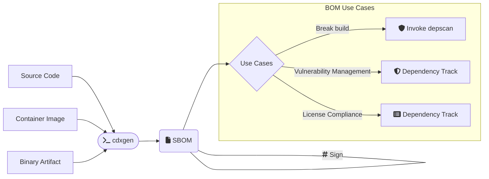

# CLI Usage

## Overview

In CLI mode, you can invoke cdxgen with Source Code, Container Image, or Binary Artifact as input to generate a Software Bill-of-Materials document. This can be subsequently used for a range of use cases as shown.

## Command map

The package ships multiple CLI entry points. Use this table as the top-level navigation map.

| Command        | Purpose                                                                                                  | Standalone release binary | Dedicated docs                     |
| -------------- | -------------------------------------------------------------------------------------------------------- | ------------------------- | ---------------------------------- |
| `cdxgen`       | Generate CycloneDX and SPDX BOMs from source, images, binaries, git URLs, or purls                       | yes                       | [CLI Usage](CLI.md)                |
| `aibom`        | Generate AI-BOM-oriented inventories from source, Hugging Face references, Modelfiles, or GGUF artifacts | yes                       | [AI_BOM.md](AI_BOM.md)             |
| `hbom`         | Generate a CycloneDX hardware BOM for the current host, with optional protobuf export                    | yes (`hbom`, `hbom-slim`) | [HBOM.md](HBOM.md)                 |
| `cdx-audit`    | Explainable upstream dependency risk prioritization from existing BOMs                                   | yes                       | [CDX_AUDIT.md](CDX_AUDIT.md)       |
| `cdx-convert`  | Convert CycloneDX JSON or protobuf to SPDX 3.0.1 JSON-LD, or to another CycloneDX spec version           | yes                       | [CDX_CONVERT.md](CDX_CONVERT.md)   |
| `cdx-sign`     | Sign a CycloneDX BOM                                                                                     | yes                       | [CDX_SIGN.md](CDX_SIGN.md)         |
| `cdx-validate` | Validate structure, compliance, and signatures                                                           | yes                       | [CDX_VALIDATE.md](CDX_VALIDATE.md) |
| `cdx-verify`   | Verify BOM signatures                                                                                    | yes                       | [CDX_VERIFY.md](CDX_VERIFY.md)     |
| `cbom`         | Generate CBOM-oriented inventories with crypto and evidence defaults                                     | yes                       | [CLI Usage](CLI.md)                |
| `obom`         | Generate live OS/runtime inventories; equivalent default type is `os`                                    | yes                       | [OBOM_LESSONS.md](OBOM_LESSONS.md) |
| `saasbom`      | Generate SaaSBOM-oriented inventories with service-evidence defaults                                     | yes                       | [CLI Usage](CLI.md)                |
| `tracebom`     | Dynamic SBOM via process tracing                                                                         | yes                       | [TRACEBOM.md](TRACEBOM.md)         |
| `evinse`       | Add evidence, call stacks, reachability, and service data                                                | no                        | [EVINSE.md](EVINSE.md)             |
| `cdxi`         | Explore BOMs interactively in the REPL                                                                   | no                        | [REPL.md](REPL.md)                 |

## Aliases and entry-point behavior

Some commands are focused aliases rather than separate implementations.

| Alias                                         | Equivalent behavior                                                                                                                              |
| --------------------------------------------- | ------------------------------------------------------------------------------------------------------------------------------------------------ |
| `aibom`                                       | `cdxgen -t ai --include-formulation --bom-audit-categories ai-bom`                                                                               |
| `obom`                                        | `cdxgen -t os`                                                                                                                                   |
| `hbom`                                        | dedicated HBOM command backed by `@cdxgen/cdx-hbom`; includes `hbom diagnostics`; equivalent library path: `cdxgen -t hbom`                      |
| `spdxgen`                                     | `cdxgen --format spdx`                                                                                                                           |
| `cbom`                                        | `cdxgen` with `includeCrypto`, `evidence`, `deep`, and CycloneDX `1.7` defaults suited for CBOM generation; rejects `-t os` — use `obom` instead |
| `saasbom`                                     | `cdxgen` with `evidence`, `deep`, and CycloneDX `1.7` defaults suited for service-evidence collection                                            |
| `cdxgen-secure`                               | `cdxgen` with secure mode enabled and dependency installation disabled by default                                                                |
| `aibom`, `cbom`, `obom`, `saasbom`, `spdxgen` | still accept the regular `cdxgen` flags in addition to their alias behavior                                                                      |

Installing `@cdxgen/cdxgen` from npm exposes the commands in the command map plus the aliases in this section. The standalone `aibom`, `cbom`, `obom`, and `saasbom` release binaries preserve the same alias behavior. The `cbom`, `obom`, and `saasbom` binaries also include protobuf export support, so `--export-proto --proto-bin-file <file>` works without installing optional npm dependencies separately.

## HBOM command

Use `hbom` when you want a hardware BOM for the current host rather than a software inventory.

- Supported collector targets currently come from `@cdxgen/cdx-hbom` (`darwin/arm64`, `linux/amd64`, and `linux/arm64`).
- `hbom` dynamically loads the optional hardware collector only when you invoke the command or request `cdxgen -t hbom`.
- Standalone release assets ship as both `hbom-<os>-<arch>` and `hbom-<os>-<arch>-slim`. The standard `hbom` binary bundles `@cdxgen/cdx-hbom` plus the matching `@cdxgen/cdxgen-plugins-bin*` helpers, while `hbom-slim` keeps only `@cdxgen/cdx-hbom`.
- Do not mix `hbom` with software project types in the same run. Generate SBOMs and HBOMs separately.
- `--dry-run` for HBOM still returns a read-only partial BOM when safe local discovery is possible, while blocking collector commands and output writes.
- Use `hbom diagnostics` when you want a fast summary of missing Linux utilities and permission-sensitive enrichments before deciding whether to install packages or rerun with `--privileged`.

Examples:

```shell
hbom -o hbom.json
hbom -o hbom.json --export-proto --proto-bin-file hbom.cdx
hbom -p
hbom diagnostics
hbom diagnostics --input hbom.json
hbom diagnostics --input hbom.cdx
hbom --platform linux --arch amd64 --privileged -o linux-hbom.json
cdxgen -t hbom -o hbom.json .
```

## Dry-run mode

Use `--dry-run` when you want a read-only review of what cdxgen would attempt.

- cdxgen reads local project files only.
- It blocks child-process execution, filesystem writes, temp-dir creation, repository cloning, protobuf export, signing, and remote submission.
- At the end of the run, cdxgen prints an activity summary table that highlights what completed and what was intentionally blocked.
- `--bom-audit` still runs the in-memory formulation audit in dry-run mode, but the predictive dependency audit only plans targets and skips registry metadata fetches, upstream repository cloning, and child SBOM generation.
- HBOM dry-runs are more granular: the optional `@cdxgen/cdx-hbom` collector records the exact blocked hardware commands and can still return a partial hardware BOM from safe local discovery.

Example:

```shell
cdxgen --dry-run -t js -p .
```

ASAR example:

```shell
cdxgen --dry-run -t asar -o bom.json /absolute/path/to/app.asar
```

In normal mode, `-t asar` adds archive file inventory, SHA-256 hashes, per-file evidence, JavaScript capability summaries, and embedded Node.js package inventory from manifests shipped inside the archive.

## Build introspection

`--introspect` turns on build introspection: cdxgen records structured
build-adequacy events while it runs, grades each scanned ecosystem against a
fidelity tier ladder (`resolved` > `lockfile` > `manifest` > `heuristic` >
`absent`), and reports how much the build environment limited the BOM's
completeness. Introspection measures the environment the user actually has, so
it never installs dependencies and never implies `--bom-audit`.

```shell
cdxgen -t java --introspect -o bom.json .
```

What a run produces:

- A markdown report next to the BOM (`bom.json.introspection.md` by default)
  with the verdict, per-ecosystem scores, ranked remediations, and the exact
  invocation to reproduce the run.
- A JSON report (`bom.json.introspection.json` by default) with the same
  verdict as a versioned document for remediation loops.
- A short console summary naming both report paths. Reports are written before
  the summary prints, so the paths it names exist.
- With `--introspect-annotate` (the default), eight
  `cdx:introspection:*` metadata properties plus document-level annotations
  inside the BOM itself, so a consumer who receives only the BOM still learns
  how much to trust it.

Destinations: pass `--introspect-report <path>` and `--introspect-json <path>`
to choose your own paths. `-` writes the markdown report to stderr. When the
BOM goes to stdout (`-o -`) or no output file is produced, the reports default
to `cdxgen-introspection.md` and `cdxgen-introspection.json` in the working
directory and the summary names where they went.

Without `--introspect` on the command line, `CDXGEN_INTROSPECT=true` is an
equivalent, and `--profile introspect` bundles introspection with annotations,
formulation, and evidence collection. `--no-introspect` keeps introspection off
even under the profile and warns; the profile's other settings still apply.

Under `--dry-run`, the report is produced with every remediation marked
blocked (nothing can be fixed without executing commands) and no file is
written; the markdown report goes to stderr.

### Evidence in the reports

A remediation the ledger ranked carries an `evidence` block — the failed
command, its exit code, the diagnosed cause, and an `outputExcerpt` of at
most the last 2000 characters of the command's combined output — in both
reports and in the markdown's "Failed command output" block, so the entry an
agent is about to act on shows the failure it fixes. Excerpts are redacted
with the same field-aware redactor as every other free-text field: sensitive
assignments and space-separated credential flags (`--password x`,
`-p x`, `--registry-token x`, `PGPASSWORD=x`), echoed `Authorization` and
`Cookie` headers, 32+-character token runs beside a credential name, URL
userinfo and query strings, and the user's home directory path. Set
`CDXGEN_INTROSPECT_NO_OUTPUT=true` to suppress excerpts entirely while
keeping the exit codes and causes.

### Version pins in the reports

cdxgen reads the version pins a project declares through its well-known tool
pin files — `.tool-versions`, `.nvmrc`, `.java-version`, `.python-version`,
`pyproject.toml`, `go.mod`, `rust-toolchain`/`rust-toolchain.toml`,
`package.json`, `global.json`, `.sdkmanrc`, and the Gradle/Maven wrapper
properties — and records what it found in the introspection reports.
Install commands in remediation actions substitute the strongest source that
answers: a version the build itself named in a mismatch report first, then a
pin file, then a `-t` type pin, then any other recorded expectation. Each
resolved action names the source in `versionFrom` with the reason in
`versionSource`; when nothing answers, the command keeps its `{{version}}`
placeholder and the action says so with `versionSourceMissing: true` — the
version is then the user's decision, never an invention.

### CI gate

`--introspect-fail-below <n>` fails the run when the overall introspection
score is below `n` (0-100):

```shell
cdxgen -t java --introspect --introspect-fail-below 70 -o bom.json .
```

The BOM and the reports are always written first — the gate never withholds
output. The exit status is **4**, distinct from the generic failure status 1,
so a CI job can tell "cdxgen failed to generate the SBOM" (exit 1) from "the
SBOM was generated but is not good enough" (exit 4). The two need different
responses: retry or fix the tooling for the first, fix the build environment
and re-generate for the second.

`--fail-on-error` interacts with introspection the same way: the failing
extractor stops immediately and takes no incomplete-result fallback, but on
an introspected run the BOM and both reports are still written and the exit
status is **5** — "an extractor failed", distinct from 1 (no BOM), 4 (a
below-threshold score) and 0. Without `--introspect`, `--fail-on-error` still
exits 1 and writes no BOM. When a deferred failure and a failed gate both
apply, the failure wins the exit status. A failure that leaves no BOM at all
— an image archive that cannot be exported, say — keeps exit 1, because
there is no verdict to read.

Every dependency extractor defers this way: the JVM, JavaScript, Python,
Ruby, PHP, .NET, Go, Rust, Clojure, Swift, CocoaPods and container
collectors, plus deep-mode environment provisioning. BOM _submission_
failures are unchanged and keep their own exit status.

### Introspection in `cdx-audit`

`cdx-audit --direct-bom-audit --introspect <bom.json>` grades a BOM it did not
generate — including the previous iteration's BOM, which is how a remediation
loop compares progress without re-running generation. Verdicts from audited
BOMs rest on BOM structure alone and carry `ledger.source: "none"` in the JSON
to say so.

For source-based scans, the primary positional input accepted by `cdxgen` can be:

- a local filesystem path such as `.` or `/path/to/repo`
- a git URL such as `https://github.com/org/repo.git`
- a package URL (purl) such as `pkg:npm/lodash@4.17.21`

When given a git URL, cdxgen clones the repository first. When given a purl, cdxgen resolves the purl to source repository metadata, clones the resolved source, and then performs the normal scan.

Quick cache-catalog examples:

```bash
# Catalogue the local Cargo cache
cdxgen -t cargo-cache -o cargo-cache-bom.json .
```



## Installing

Install the npm package when you want the full multi-command CLI surface.

**npm**:

```shell
npm install -g @cdxgen/cdxgen --omit=optional --ignore-scripts --min-release-age=2
```

**pnpm**:

```shell
pnpm add -g @cdxgen/cdxgen --omit=optional --ignore-scripts --minimum-release-age=2880
```

**bun**:

```shell
bun install -g @cdxgen/cdxgen --ignore-scripts
```

You can also invoke any packaged command without a global install:

```shell
corepack pnpm dlx @cdxgen/cdxgen --help
corepack pnpm dlx --package=@cdxgen/cdxgen hbom --help
corepack pnpm dlx --package=@cdxgen/cdxgen cdx-audit --help
corepack pnpm dlx --package=@cdxgen/cdxgen cdx-convert --help
corepack pnpm dlx --package=@cdxgen/cdxgen cdx-validate --help
corepack pnpm dlx --package=@cdxgen/cdxgen cdx-sign --help
corepack pnpm dlx --package=@cdxgen/cdxgen cdx-verify --help
corepack pnpm dlx --package=@cdxgen/cdxgen evinse --help
corepack pnpm dlx --package=@cdxgen/cdxgen cdxi --help
```

If you are a [Homebrew](https://brew.sh/) user, you can also install [cdxgen](https://formulae.brew.sh/formula/cdxgen) via:

```shell
$ brew install cdxgen
```

Deno install is also supported.

```shell
deno install --allow-read --allow-env --allow-run --allow-sys=uid,systemMemoryInfo,gid,homedir --allow-write --allow-net -n cdxgen "npm:@cdxgen/cdxgen/cdxgen"
```

You can also use the cdxgen container image

```bash
docker run --rm -v /tmp:/tmp -v $(pwd):/app:rw -t ghcr.io/cdxgen/cdxgen -r /app -o /app/bom.json
```

### Standalone release binaries

GitHub Releases publish single-file executables for `cdxgen`, `cdxgen-slim`, `cbom`, `obom`, `saasbom`, `hbom`, `hbom-slim`, `cdx-audit`, `cdx-convert`, `cdx-sign`, `cdx-validate`, and `cdx-verify`.

For HBOM, use `hbom-<os>-<arch>` when you want the dedicated hardware collector together with the companion `@cdxgen/cdxgen-plugins-bin*` bundle, or `hbom-<os>-<arch>-slim` when you only need `@cdxgen/cdx-hbom` in the standalone executable.

The focused alias binaries use smaller dependency profiles than full `cdxgen`: `cbom` and `saasbom` include the Atom analysis packages needed for evidence collection, while `obom` includes the target platform plugin bundle pruned to runtime OS helpers. All three also include `@cdxgen/cdx-proto` and `@bufbuild/protobuf` for `--export-proto`.

Use the asset name that matches your platform, for example `cdx-audit-linux-amd64`, `cdx-audit-darwin-arm64`, or `cdx-audit-windows-amd64.exe`.

Each binary extracts itself into a cache directory on its first run, and on Linux and macOS extracts its large native plugins as scans need them; see [First run and the extraction cache](README.md#first-run-and-the-extraction-cache) for the cache location and the variables that control it.

#### Linux

```bash
VERSION="v13.0.0"
ASSET="cdx-audit-linux-amd64"
BASE_URL="https://github.com/cdxgen/cdxgen/releases/download/${VERSION}"

curl -fsSLO "${BASE_URL}/${ASSET}"
curl -fsSLO "${BASE_URL}/${ASSET}.sha256"
sha256sum -c "${ASSET}.sha256"
chmod +x "${ASSET}"
./"${ASSET}" --help
```

#### macOS

```bash
VERSION="v13.0.0"
ASSET="cdx-audit-darwin-arm64"
BASE_URL="https://github.com/cdxgen/cdxgen/releases/download/${VERSION}"

curl -fsSLO "${BASE_URL}/${ASSET}"
curl -fsSLO "${BASE_URL}/${ASSET}.sha256"
shasum -a 256 -c "${ASSET}.sha256"
chmod +x "${ASSET}"
./"${ASSET}" --help
```

#### Windows (PowerShell)

```powershell
$Version = "v13.0.0"
$Asset = "cdx-audit-windows-amd64.exe"
$BaseUrl = "https://github.com/cdxgen/cdxgen/releases/download/$Version"

Invoke-WebRequest -Uri "$BaseUrl/$Asset" -OutFile $Asset
Invoke-WebRequest -Uri "$BaseUrl/$Asset.sha256" -OutFile "$Asset.sha256"
$Expected = (Get-Content "$Asset.sha256" | Select-Object -First 1).Trim().Split()[0]
$Actual = (Get-FileHash $Asset -Algorithm SHA256).Hash.ToLowerInvariant()
if ($Actual -ne $Expected.ToLowerInvariant()) {
  throw "SHA256 mismatch for $Asset"
}
.\$Asset --help
```

#### GitHub Actions with the GitHub CLI

```yaml
permissions:
  contents: read

steps:
  - name: Download cdx-audit standalone binary
    env:
      GH_TOKEN: ${{ github.token }}
    run: |
      gh release download v13.0.0 \
        --repo cdxgen/cdxgen \
        --pattern 'cdx-audit-linux-amd64' \
        --pattern 'cdx-audit-linux-amd64.sha256'
      sha256sum -c cdx-audit-linux-amd64.sha256
      chmod +x cdx-audit-linux-amd64
      ./cdx-audit-linux-amd64 --help
```

To use the deno version, use `ghcr.io/cdxgen/cdxgen-deno` as the image name.

```bash
docker run --rm -v /tmp:/tmp -v $(pwd):/app:rw -t ghcr.io/cdxgen/cdxgen-deno -r /app -o /app/bom.json
```

In deno applications, cdxgen could be directly imported without any conversion.

```ts
import { createBom, submitBom } from "npm:@cdxgen/cdxgen";
```

## Getting Help

```text
cdxgen [command]

Commands:
  cdxgen completion  Generate bash/zsh completion

Options:
  -o, --output                    Output file. Default bom.json                                    [default: "bom.json"]
  -t, --type                      Project type. Please refer to https://cdxgen.github.io/cdxgen/#/PROJECT_TYPES for
                                  supported languages/platforms.                                                 [array]
      --exclude-type              Project types to exclude. Please refer to
                                  https://cdxgen.github.io/cdxgen/#/PROJECT_TYPES for supported languages/platforms.
  -r, --recurse                   Recurse mode suitable for mono-repos. Defaults to true. Pass --no-recurse to disable.
                                                                                               [boolean] [default: true]
  -p, --print                     Print the SBOM as a table with tree.                                         [boolean]
      --tui                       Launch the terminal user interface (cdxui)                                   [boolean]
  -c, --resolve-class             Resolve class names for packages. Jar projects only.                          [boolean]
      --deep                      Perform deep searches for components. Useful while scanning C/C++ apps, live OS and
                                  oci images.                                                                  [boolean]
      --cmake-cache               Path to the CMakeCache.txt of a configured C/C++ build. Overrides the lookup in the
                                  build directories of the CMake presets, build*/, out/, builddir/ and cmake-build-*/.
                                                                                                                [string]
      --compile-commands          Path to the compile_commands.json of a C/C++ build, or a directory holding one. atom
                                  then parses each file with its build's include paths, macros and language. Overrides
                                  the lookup in the project root and its build directories (those of the CMake presets,
                                  build*/, out/, builddir/, cmake-build-*/), which is skipped in secure mode.   [string]
      --git-branch                Git branch to clone when the source is a git URL or purl                      [string]
      --server-url                Dependency track url. Eg: https://deptrack.cyclonedx.io                       [string]
      --skip-dt-tls-check         Skip TLS certificate check when calling Dependency-Track.   [boolean] [default: false]
      --api-key                   Dependency track api key                                                      [string]
      --project-group             Dependency track project group
      --project-name              Dependency track project name. Default use the directory name
      --project-version           Dependency track project version                                [string] [default: ""]
      --project-tag               Dependency track project tag. Multiple values allowed.
      --project-id                Dependency track project id. Either provide the id or the project name and version
                                  together                                                                      [string]
      --parent-project-id         Dependency track parent project id                                            [string]
      --parent-project-name       Dependency track parent project name                                          [string]
      --parent-project-version    Dependency track parent project version                                       [string]
      --required-only             Include only the packages with required scope on the SBOM. Would set
                                  compositions.aggregate to incomplete unless --no-auto-compositions is passed.[boolean]
      --fail-on-error             Fail if any dependency extractor fails.                     [boolean] [default: false]
      --dry-run                   Read-only mode. cdxgen only performs file reads and reports blocked writes,
                                  command execution, temp creation, network access, and submissions.
                                                                                               [boolean] [default: false]
      --no-babel                  Do not use babel to perform usage analysis for JavaScript/TypeScript projects.
                                                                                                               [boolean]
      --generate-key-and-sign     Generate a public/private key pair for SBOM_SIGN_ALGORITHM (RS512 by default) and
                                  then sign the generated SBOM using the JSON Signature Format (JSF).          [boolean]
      --server                    Run cdxgen as a server                                                       [boolean]
      --server-host               Listen address                                         [string] [default: "127.0.0.1"]
      --server-port               Listen port                                                   [number] [default: 9090]
      --install-deps              Install dependencies automatically for some projects. Defaults to true but disabled
                                  for containers and oci scans. Use --no-install-deps to disable this feature.
                                                                                               [boolean] [default: true]
      --package-extensions        Apply npm packageExtensions manifest repairs on --deep scans. Defaults to true,
                                  matching npm. Pass --no-package-extensions to produce a BOM that reflects manifests
                                  as published.                                                [boolean] [default: true]
      --validate                  Validate the generated SBOM using json schema. Defaults to true. Pass --no-validate to
                                  disable.                                                     [boolean] [default: true]
      --evidence                  Generate SBOM with evidence for supported languages.        [boolean] [default: false]
      --spec-version              CycloneDX Specification version to use. Defaults to 1.7. Accepted generation
                                  targets: 1.6, 1.7, 2.0. 1.4 and 1.5 are rejected as generation targets; generate at 1.6+
                                  and convert the output with `cdx-convert --to 1.5` if a legacy document is needed.
                                                                        [number] [choices: 1.6, 1.7, 2.0] [default: 1.7]
      --filter                    Filter components containing this word in purl or component.properties.value. Multiple
                                  values allowed.                                                                [array]
      --only                      Include components only containing this word in purl. Useful to generate BOM with
                                  first party components alone. Multiple values allowed.                         [array]
      --author                    The person(s) who created the BOM. Set this value if you're intending the modify the
                                  BOM and claim authorship.                        [array] [default: "OWASP Foundation"]
      --profile                   BOM profile to use for generation. Default generic.
  [choices: "appsec", "research", "operational", "threat-modeling", "license-compliance", "generic", "machine-learning",
                                     "ml", "deep-learning", "ml-deep", "ml-tiny", "introspect"] [default: "generic"]
      --introspect                Reflect on how the build environment limited BOM completeness and write an
                                  introspection report. Enabled by --profile introspect or CDXGEN_INTROSPECT=true.
                                  Pass --no-introspect to keep it off.                                          [boolean]
      --introspect-report         Path for the markdown introspection report. Defaults to
                                  <output>.introspection.md; '-' writes the report to stderr.                    [string]
      --introspect-json           Path for the JSON introspection report consumed by remediation loops. Defaults to
                                  <output>.introspection.json.                                                   [string]
      --introspect-fail-below     CI gate: exit with status 4 after the BOM is written when the overall
                                  introspection score is below this 0-100 threshold. Absent means the gate never
                                  fails.                                                                        [number]
      --introspect-annotate       Carry the introspection verdict inside the BOM as metadata properties and
                                  annotations. Enabled with --introspect; pass --no-introspect-annotate to keep the
                                  BOM untouched.                                              [boolean] [default: true]
      --include-regex             glob pattern to include. This overrides the default pattern used during
                                  auto-detection.                                                               [string]
      --exclude, --exclude-regex  Additional glob pattern(s) to ignore                                           [array]
      --no-ignore                 Disable default ignore lists (such as .git, .hg, node_modules) during scanning.
                                                                                              [boolean] [default: false]
      --caxa-app-dir              Directory of the app a caxa binary extracts. With -t caxa, also records the native
                                  tools, the vendored PHP, Ruby and Java packages, and the npm integrity hashes found
                                  there.                                                                        [string]
      --export-proto              Serialize and export BOM as protobuf binary.                [boolean] [default: false]
      --format                    Export format(s). Supports cyclonedx, spdx, repeated --format flags, or a
                                  comma-separated list such as cyclonedx,spdx.                                   [array]
      --proto-bin-file            Path for the serialized protobuf binary.                          [default: "bom.cdx"]
      --include-formulation       Generate formulation section with git metadata and build tools. Defaults to false.
                                                                                              [boolean] [default: false]
      --include-crypto            Include crypto libraries as components.                     [boolean] [default: false]
      --license-policy            Path to a license compliance policy YAML file.                                 [string]
      --license-ref               Synthesize custom LicenseRef IDs for unresolved licenses.   [boolean] [default: false]
      --metadata-property         Custom property to add to the BOM metadata, as name=value. Repeat the flag for several
                                  properties. Combined with the properties of the CDXGEN_METADATA_PROPERTIES environment
                                  variable and of a config file.                                                 [array]
      --standard                  The list of standards which may consist of regulations, industry or
                                  organizational-specific standards, maturity models, best practices, or any other
                                  requirements which can be evaluated against or attested to.
       [array] [choices: "asvs-5.0", "asvs-4.0.3", "bsimm-v13", "masvs-2.0.0", "nist_ssdf-1.1", "pcissc-secure-slc-1.1",
                                                                                     "scvs-1.0.0", "ssaf-DRAFT-2023-11"]
      --json-pretty               Pretty-print the generated BOM json.                        [boolean] [default: false]
      --min-confidence            Minimum confidence needed for the identity of a component from 0 - 1, where 1 is 100%
                                  confidence.                                                      [number] [default: 0]
      --technique                 Analysis technique to use
            [array] [choices: "auto", "source-code-analysis", "binary-analysis", "manifest-analysis", "hash-comparison",
                                                                                          "instrumentation", "filename"]
      --auto-compositions         Automatically set compositions when the BOM was filtered. Defaults to true
                                                                                               [boolean] [default: true]
  -h, --help                      Show help                                                                    [boolean]
  -v, --version                   Show version number                                                          [boolean]
      --verbose                   Increase log verbosity. Repeat for more detail: --verbose shows per-file detail,
                                  --verbose --verbose enables debug output. (Env: CDXGEN_LOG_LEVEL, CDXGEN_DEBUG_MODE)
                                                                                                                 [count]
  -q, --quiet                     Silent mode: show errors only. (Env: CDXGEN_LOG_LEVEL=silent)
                                                                                              [boolean] [default: false]
      --progress                  Live progress region. Pass --no-progress to force static output. (Env:
                                  CDXGEN_NO_PROGRESS)                                          [boolean] [default: true]
      --color                     When to colorize output. auto detects the terminal. (Env: CDXGEN_COLOR, NO_COLOR,
                                  FORCE_COLOR)                    [choices: "auto", "always", "never"] [default: "auto"]
      --log-format                Diagnostic log format. json emits NDJSON records to stderr and disables the live
                                  region. (Env: CDXGEN_LOG_FORMAT)           [choices: "text", "json"] [default: "text"]
      --rust                      Use Rust-native (cdxrs) acceleration where available. Pass --no-rust to force the JS
                                  path.                                                        [boolean] [default: true]
      --cache                     Use the on-disk metadata cache for registry lookups. Pass --no-cache to bypass it for
                                  this run.                                                    [boolean] [default: true]
      --cache-ttl                 Override the metadata cache TTL in seconds. 0 means never expire. Default: 86400
                                  (24h).                                                                        [number]

Examples:
  cdxgen -t java .                       Generate a Java SBOM for the current directory
  cdxgen -t java -t js .                 Generate a SBOM for Java and JavaScript in the current directory
  cdxgen -t java --profile ml .          Generate a Java SBOM for machine learning purposes.
  cdxgen -t python --profile research .  Generate a Python SBOM for appsec research.
  cdxgen --server                        Run cdxgen as a server

for documentation, visit https://cdxgen.github.io/cdxgen
```

All boolean arguments accept `--no` prefix to toggle the behavior.

## Source input examples

The examples below all use the same positional source argument slot. Replace `.` with a git URL or a supported purl when needed.

### Local path

```shell
cdxgen -t java -o bom.json .
```

You can also scan an explicit absolute path:

```shell
cdxgen -t js -o /tmp/bom.json /Users/me/work/my-app
```

### Git URL

```shell
cdxgen -t java -o bom.json --git-branch main https://github.com/HooliCorp/java-sec-code.git
```

Another example using the default branch:

```shell
cdxgen -t js -o bom.json https://github.com/cdxgen/cdxgen.git
```

### Package URL (purl)

```shell
cdxgen -t js -o bom.json "pkg:npm/lodash@4.17.21"
```

For other ecosystems, pass the purl directly as the source input:

```shell
cdxgen -t python -o bom.json "pkg:pypi/requests@2.32.3"
cdxgen -t java -o bom.json "pkg:maven/org.apache.logging.log4j/log4j-core@2.24.3"
```

For purl inputs, cdxgen resolves registry metadata to locate a repository URL, clones the source to a temporary directory, and runs the normal SBOM + post-processing pipeline.

Supported purl source types:

- `npm`, `pypi`, `gem`, `cargo`, `pub`, `maven` (version required), `composer` (registry metadata lookup)
- `github`, `bitbucket` (direct repository mapping)
- `generic` (requires `vcs_url` or `download_url` qualifier)

> **Security note:** Registry metadata can be inaccurate or malicious. Validate the resolved repository URL before relying on the SBOM.

## Export formats

CycloneDX remains the default export format.

Use `--format spdx` to emit an SPDX 3.0.1 JSON-LD document:

```shell
cdxgen -t nodejs --format spdx -o bom.spdx.json .
```

Use `--format cyclonedx,spdx` to emit both formats in one run. The `--output`
path is used for the CycloneDX file and cdxgen writes a sibling `*.spdx.json`
file for the SPDX export:

```shell
cdxgen -t nodejs --format cyclonedx,spdx -o bom.cdx.json .
```

You can also repeat `--format` to request both outputs:

```shell
cdxgen -t nodejs --format cyclonedx --format spdx -o bom.cdx.json .
```

If the output file already ends with `.spdx.json`, cdxgen automatically selects
the SPDX export format:

```shell
cdxgen -t nodejs -o bom.spdx.json .
```

When `--validate` is enabled, cdxgen validates the generated SPDX 3.0.1 export
after converting the final CycloneDX BOM.

## Converting an existing BOM

Use the dedicated `cdx-convert` command to convert an existing CycloneDX JSON
or protobuf file into SPDX JSON-LD:

```shell
cdx-convert -i bom.json -o bom.spdx.json
cdx-convert -i bom.cdx -o bom.spdx.json
```

`cdx-convert` supports CycloneDX 1.6 and 1.7 inputs and exports SPDX 3.0.1.

Pass `--to` with a CycloneDX specification version to convert between CycloneDX
versions instead. Fields the target version does not define are listed on stderr
before the file is written:

```shell
cdx-convert -i bom.json --to 1.6              # writes bom-1_6.json
cdx-convert -i bom.json --to 1.6 -o old.cdx   # writes protobuf
```

Refer to [cdx-convert — CycloneDX converter](CDX_CONVERT.md) for complete usage.

## Dynamic Process Tracing (Dynamic SBOM)

Dynamic tracing is performed with the dedicated `tracebom` command, which runs a target command under the `@cdxgen/safer-exec` sandbox and records the shared libraries it loads at runtime (via `dlopen`), the HTTP URLs it opens, and the services it contacts:

```shell
tracebom --cmd "node app.js" --working-dir /path/to/project
tracebom --cmd "node app.js" -d /path/to/project -o bom.json
```

- `--cmd`: The command line to execute and trace (e.g. `tracebom --cmd "node app.js"`).
- `--working-dir` (alias `-d`): Optional. The working directory for command execution.

The `--trace-cmd` and `--trace-working-dir` flags are not registered on `cdxgen -t dynamic`; they live on `tracebom` as `--cmd` and `--working-dir`. See [tracebom](TRACEBOM.md) for the full flag reference.

Dynamic trace SBOMs tag discovered libraries as `scope=required` with CycloneDX verification `evidence` technique set to `instrumentation`.
